# Template and Dashboard in Power BI

This project creates a template from scratch and a dashboard that summarize the results in Power BI.

The data can be found in the [Health Nutrition and Population Statistics](https://www.kaggle.com/datasets/theworldbank/health-nutrition-and-population-statistics/) from the World Bank stored in Kaggle.com.

## Template 

When the design of the template is ready, go to export as a template:
<p align="left">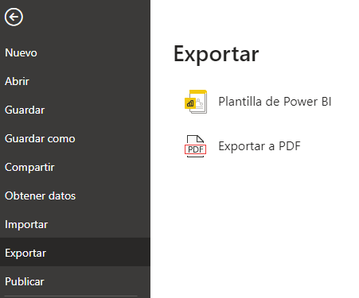</p>

Add the instructions to set up the data:
<p align="left">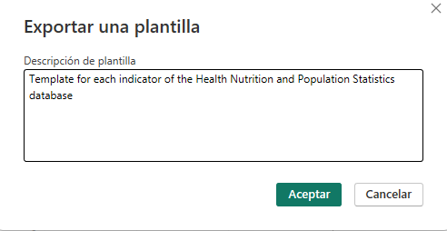</p>

Save as a template ```(*.pbit)```
<p align="left">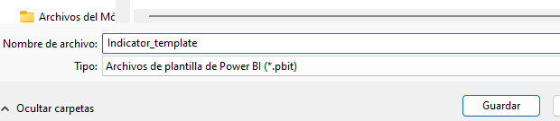</p>

Add a new parameter in Power Query:
<p align="left">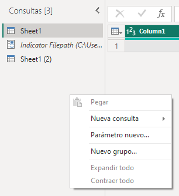</p>

Add the name of the parameter, the type as text and the filepath of the data: 
<p align="left">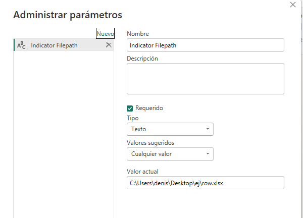</p>

In origin configurations, select the parameter created in the route:
<p align="left">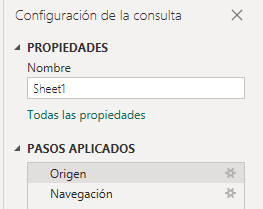</p>
<p align="left">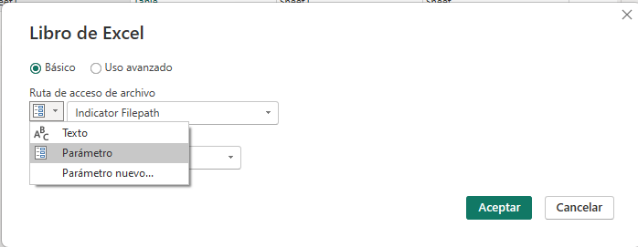</p>

To open the template, select import from ```template Power BI``` and the template saved previously:
<p align="left">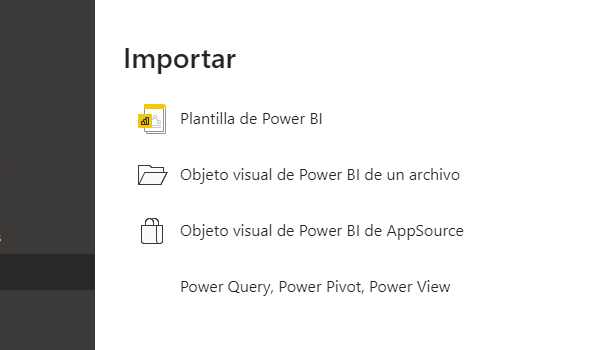</p>
<p align="left">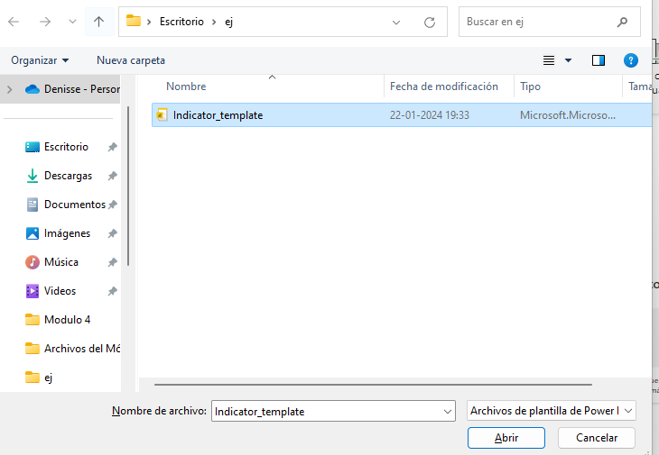</p>

Add the filepath that contains the data:
<p align="left">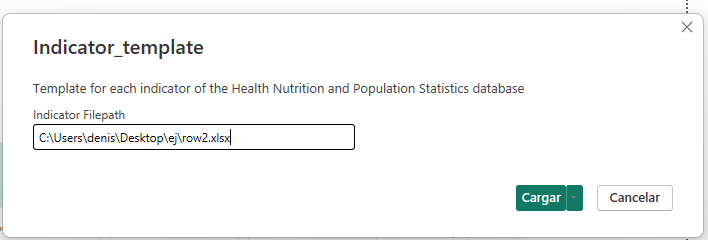</p>

The template will show the same design but the data will be different:

Data 1:
<p align="left">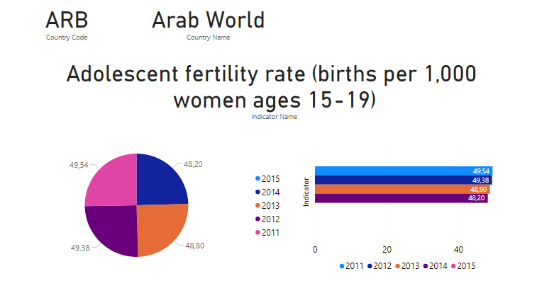</p>

Data 2:
<p align="left"></p>

## Dashboard

Main dashboard that shows the final results for indicator and country:
<p align="left">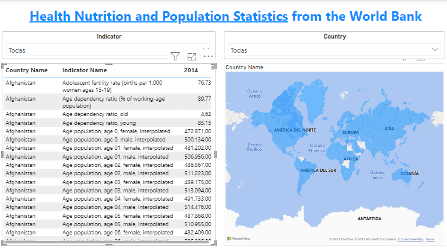</p>

Filtered by country ```Chile```
<p align="left">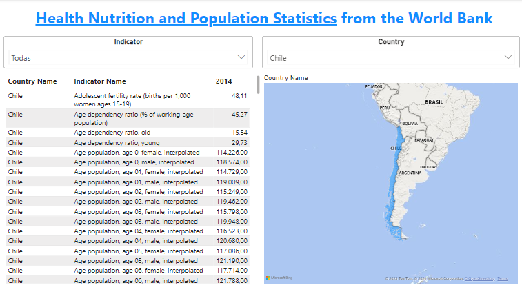</p>