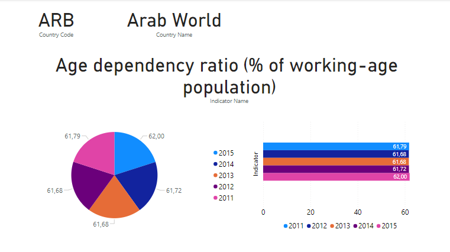

# Template and Dashboard in Power BI

This project creates a template from scratch and a dashboard that summarize the results in Power BI.

The data can be found in the [Health Nutrition and Population Statistics](https://www.kaggle.com/datasets/theworldbank/health-nutrition-and-population-statistics/) from the World Bank stored in Kaggle.com.

## Template 

## Dashboard

